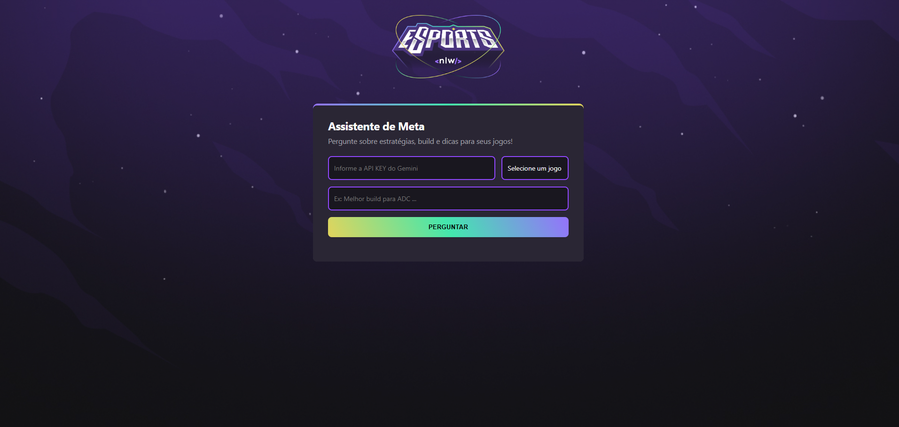

# Assistente de Meta - NLW Rocketseat

Este projeto é um **Assistente de Meta para jogos eletrônicos**, desenvolvido durante o bootcamp **NLW da Rocketseat**. Ele utiliza inteligência artificial para responder perguntas sobre estratégias, builds e dicas dos principais jogos competitivos, como Valorant, League of Legends e CS:GO.

## Funcionalidades

- **Consulta de estratégias e builds:** Informe o jogo e sua dúvida para receber respostas precisas e atualizadas sobre o meta.
- **Integração com Gemini AI:** As respostas são geradas pela API Gemini, garantindo informações relevantes e contextualizadas.
- **Interface intuitiva:** Formulário simples para inserir sua API KEY, escolher o jogo e digitar sua pergunta.
- **Respostas em Markdown:** As respostas são exibidas com formatação clara e organizada.
- **Feedback visual:** Botão de envio com animação de carregamento e exibição dinâmica das respostas.

## Tecnologias Utilizadas

- **HTML5 & CSS3:** Estrutura e estilização responsiva e moderna.
- **JavaScript (ES6):** Lógica de interação, requisições à API e manipulação do DOM.
- **Showdown.js:** Conversão de respostas em Markdown para HTML.
- **Gemini API (Google):** Geração de conteúdo inteligente e atualizado.
- **Rocketseat NLW:** Projeto desenvolvido como parte do bootcamp NLW, focado em aprendizado prático e acelerado.

## Como usar

1. Clone o repositório e instale as dependências (se necessário).
2. Insira sua API KEY do Gemini no campo indicado.
3. Escolha o jogo e digite sua pergunta.
4. Clique em **Perguntar** e aguarde a resposta do assistente.

---

Projeto criado com dedicação durante o **NLW Rocketseat**, focado em inovação e tecnologia para a comunidade
